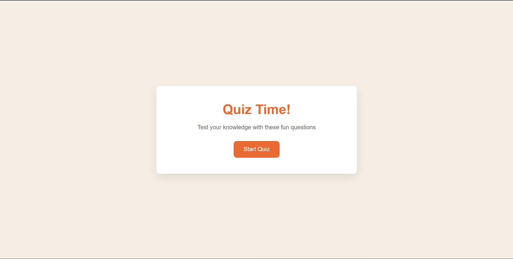
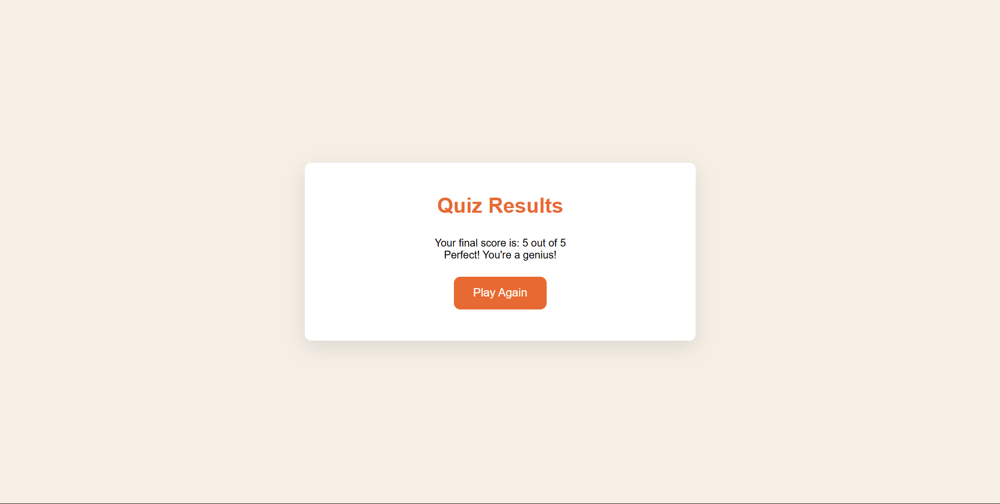

# Quiz Game

A simple web-based quiz game built with HTML, CSS, and JavaScript.

## Features

- Multiple choice questions
- Score tracking
- Progress bar
- Responsive design
- Play again option

## How to Use

1. Open `index.html` in your browser.
2. Click **Start Quiz** to begin.
3. Select the correct answer for each question.
4. View your score and feedback at the end.
5. Click **Play Again** to restart the quiz.

## File Structure

- `index.html` — Main HTML file
- `style.css` — Styles for the quiz UI
- `script.js` — Quiz logic and interactivity

## Customization

- Add or edit questions in the `quizData` array in `script.js`.
- Update styles in `style.css` as desired.

## Screenshots

---

Enjoy testing your knowledge!
